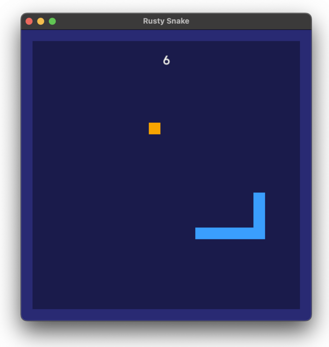

# rusty-snake

A crappy snake clone written in Rust.



Use [W, A, S, D] to move, [SPACE] to pause, [ESC] to quit.

Build:
```
cargo build
```

Run:
```
cargo run
```

Run with a custom move interval:
```
cargo run -- [move interval in seconds]
```
Default move interval is 0.2 seconds.

Note: Requires cargo to be installed (duh).
